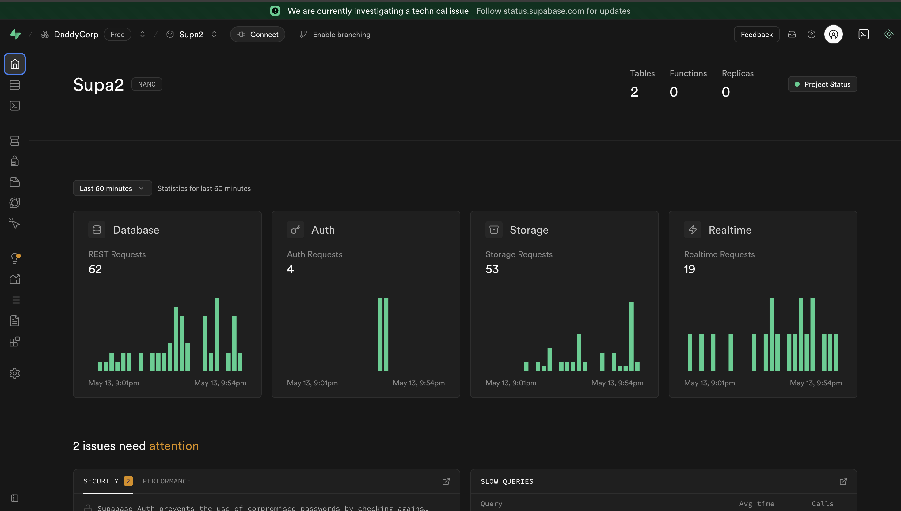

# 📝 Task Manager — Supabase x React

a basic task manager built using React + Supabase.

you can add tasks with title, description, and image.  
it saves to a Supabase table and uploads the image to Supabase Storage.

real-time updates included — when a task is added, it's reflected instantly.

---

## 📹 Demo Video

<!-- https://github.com/helloAmulya/supabase-project-1/main/src/assets/projectVideo.mov -->

[📽️ watch demo (projectVideo.mov)](./src/assets/projectVideo.mov)

> ⚠️ github won’t preview `.mov` inline — download or open manually to watch

---

---

## 🖼️ Preview

---

## ⚙️ Stack

- React (Vite)
- Supabase (Database + Storage + Realtime)
- TailwindCSS

---

## 📁 Folder Structure

